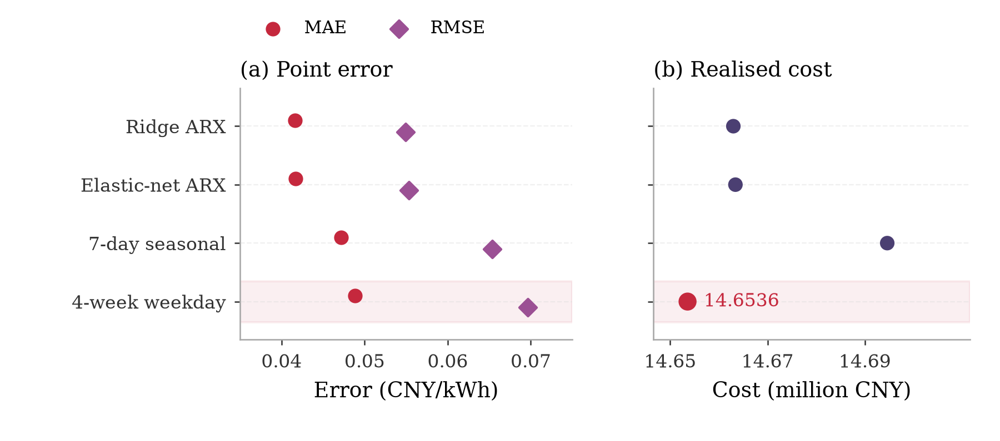
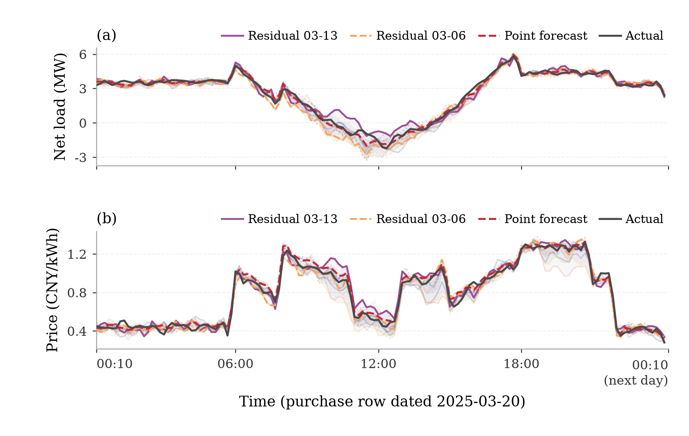
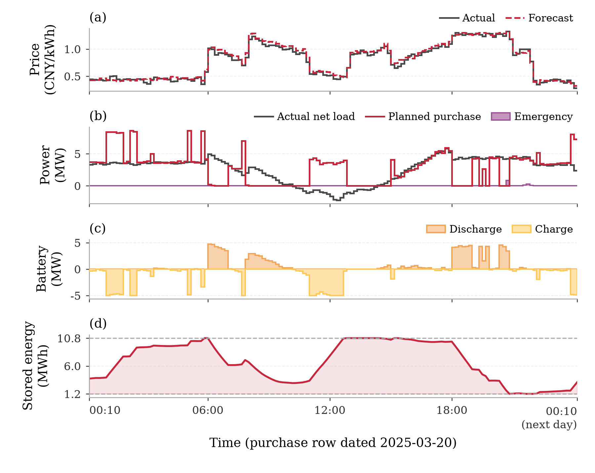
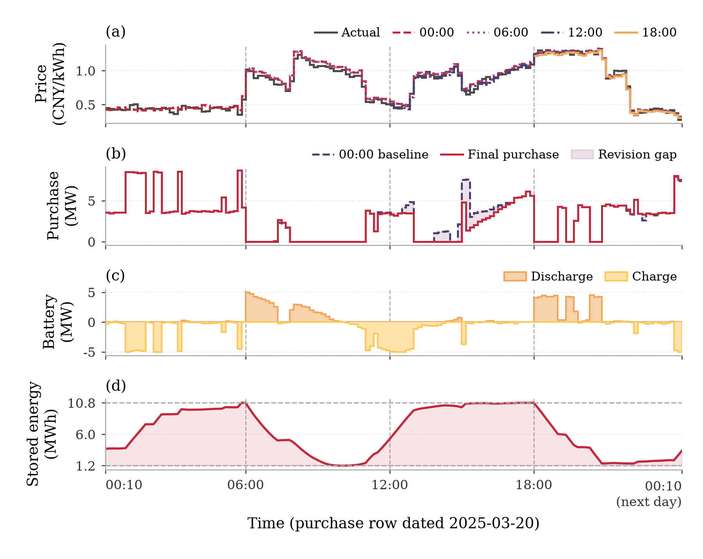
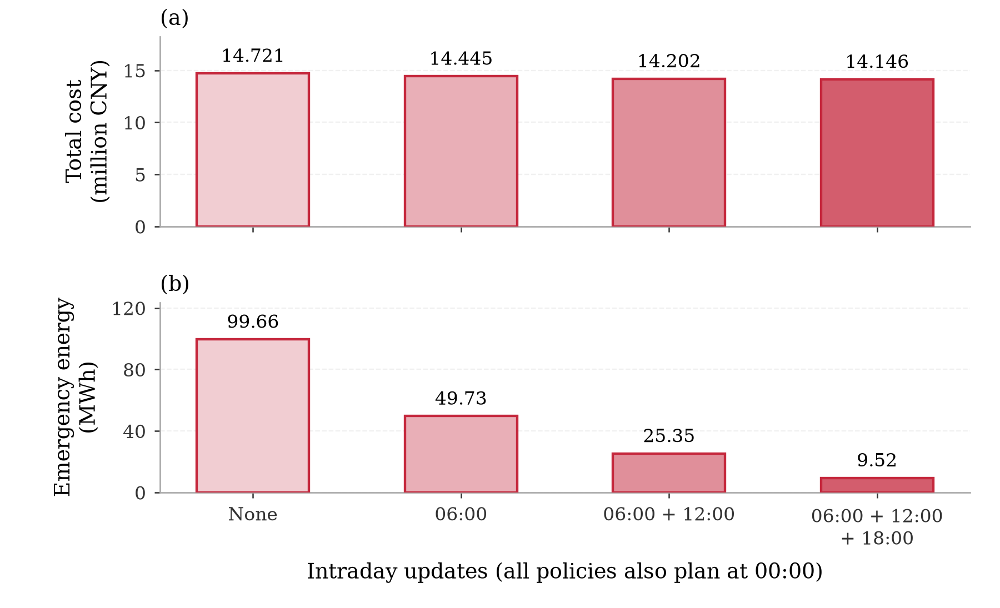
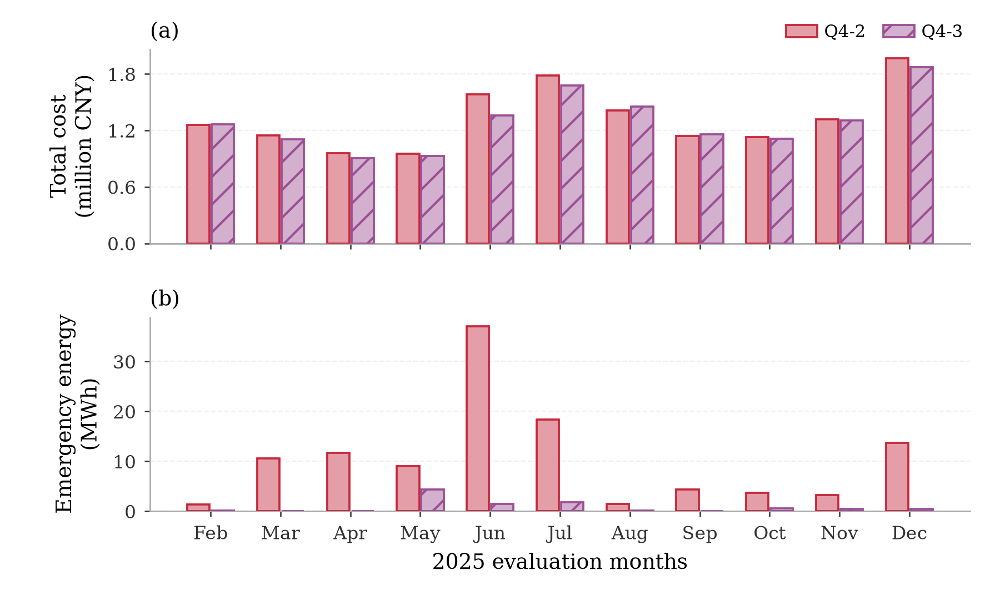

# Question 4: Microgrid Purchasing under Fluctuating Electricity Prices

> Complete English source material for Prism. This chapter combines the
> recalculation of Problem 2 (Q4-2) and Problem 3 (Q4-3). Six source-backed figures
> are available in `04_q4/figures/` (vector PDF and 300-dpi PNG), with captions
> inserted below. Use `figures/latex_includes.tex` for typesetting; Q4-F6 is
> supplementary. Equation and figure numbering may be adjusted when merged.

## 1. Problem interpretation and modelling progression

Question 4 replaces the fixed daily tariff used in Problems 2 and 3 with the
real-time fluctuating tariff in Attachment 4. This affects both planning and
settlement. A controller must decide when energy is economically worth buying,
while avoiding the use of future prices that would not be known when the
decision is made.

The development follows the earlier models rather than introducing an
independent framework:

$$
\text{Model 2: net-load residual scenarios}
\rightarrow
\begin{cases}
\text{Model 3: rolling purchase revisions},\\
\text{Model 4-2: paired price uncertainty},
\end{cases}
\rightarrow
\text{Model 4-3: rolling paired scenarios}.
$$

Model 4-2 retains Model 2's one-time midnight commitment and adds a causal
price forecast plus joint net-load--price residual paths. Model 4-3 retains
Model 3's 00:00/06:00/12:00/18:00 rolling contract and adjustment settlement,
then inserts the price process developed for Model 4-2. Hence Q4-2 measures the
value of price-aware day-ahead planning, whereas Q4-3 measures the additional
value of updating the decision when new PV and price information arrives.

## 2. Assumptions and information chronology

1. The ten-minute tariff in Attachment 4 is the realised transaction price.
   The complete operating-day price curve is not known at 00:00.
2. A decision may use only prices, load and PV observations available strictly
   before its commitment boundary. Current and future realised values are never
   used by an implementable policy.
3. The normal purchase, upward revision, downward cancellation and emergency
   purchase are settled at multipliers $1$, $1.5$, $0.5$ and $5$ of the
   contemporaneous realised price, respectively.
4. Unused surplus has no export revenue or refund. It is first stored if
   feasible and otherwise curtailed.
5. The battery has rated capacity 12,000 kWh, allowable SOC 1,200--10,800 kWh,
   maximum charge/discharge power 5,000 kW and bidirectional efficiency 90%.
6. SOC is continuous across days. The simulation starts at 6,000 kWh on January
   1. January provides causal forecast warm-up and state propagation; reported
   costs cover February 1--December 31, 2025.
7. Historical residuals are sampled as complete paths, not independently by
   interval. Net-load and price errors selected from the same historical date
   remain paired.
8. Scenario probabilities are equal, $π_s=1/12$. These are empirical scenario
   weights rather than calibrated probabilities.

The official time ordering is preserved. The source rows describe 144
consecutive ten-minute settlement intervals, and all forecasts, state links and
workbook exports use the same mapping.

## 3. Shared notation and physical model

For day $d$, interval $t$ and scenario $s$, define:

- $p^{\mathrm{act}}_{d,t}$: realised normal price (CNY/kWh);
- $\widehat p_{d,k,t}$: price forecast available at issue time $k$;
- $p^{(s)}_{d,k,t}$: scenario price;
- $N^{\mathrm{act}}_{d,t}=L^{\mathrm{act}}_{d,t}-P^{PV,\mathrm{act}}_{d,t}$:
  realised net-load energy;
- $N^{(s)}_{d,k,t}$: scenario net-load energy;
- $G_{d,t}$: Q4-2 midnight purchase;
- $q^0_{d,t}$ and $q^k_{d,t}$: Q4-3 midnight and revised purchases;
- $C^{(s)}_{d,t}$, $D^{(s)}_{d,t}$: scenario battery charge and discharge;
- $S^{(s)}_{d,t}$: scenario SOC;
- $E^{(s)}_{d,t}$: scenario shortage surrogate;
- $W^{(s)}_{d,t}$: curtailed surplus.

Every scenario satisfies

$$
q_{d,t}+D^{(s)}_{d,t}+E^{(s)}_{d,t}
-C^{(s)}_{d,t}-W^{(s)}_{d,t}=N^{(s)}_{d,t},
\tag{4.1}
$$

$$
S^{(s)}_{d,t+1}=S^{(s)}_{d,t}+0.9C^{(s)}_{d,t}
-\frac{D^{(s)}_{d,t}}{0.9},
\tag{4.2}
$$

$$
1200\le S^{(s)}_{d,t}\le10800,\qquad
0\le C^{(s)}_{d,t},D^{(s)}_{d,t}\le\frac{5000}{6}.
\tag{4.3}
$$

The model permits continuous charge and discharge variables. Positive prices,
round-trip losses, curtailment and the small cycling penalty make simultaneous
charge and discharge uneconomic; the realised solutions contain none.

## 4. Causal electricity-price forecasting

### 4.1 Candidate models

Four midnight forecasts are evaluated:

| Candidate | Information available at 00:00 |
|---|---|
| Seasonal naive | Price curve seven days earlier |
| Four-week weekday mean | Mean of lags 7, 14, 21 and 28 days when available |
| Ridge ARX | Lag-1, lag-2 and lag-7 prices, recent daily means, harmonic time variables and weekday indicators |
| Elastic-net ARX | Same predictors with combined $L_1$ and $L_2$ regularisation |

The transparent four-week forecast is

$$
\widehat p_{d,0,t}=\frac{1}{|\mathcal L_d|}
\sum_{\ell\in\mathcal L_d}p^{\mathrm{act}}_{d-\ell,t},
\qquad \mathcal L_d\subseteq\{7,14,21,28\}.
\tag{4.4}
$$

The regression models use at most 90 previous days and are refitted weekly.
Hyperparameters are selected with expanding day-blocked validation, ensuring
that each validation block follows its training block.

### 4.2 Forecast accuracy and decision-based selection

| Price model | MAE (CNY/kWh) | RMSE (CNY/kWh) | Mean daily rank correlation |
|---|---:|---:|---:|
| Ridge ARX | **0.04160** | **0.05493** | 0.95168 |
| Elastic-net ARX | 0.04168 | 0.05534 | **0.95181** |
| Seasonal naive | 0.04715 | 0.06535 | 0.94600 |
| Four-week weekday mean | 0.04886 | 0.06963 | 0.95172 |

Point accuracy is not the final selection criterion. Battery arbitrage depends
on the within-day ordering of prices, and conservative purchasing balances
normal expenditure against fivefold emergency cost. Each forecaster is
therefore evaluated through the same closed-loop controller and actual-price
settlement. Although Ridge ARX has the smallest MAE, the four-week weekday mean
produces the least realised operating cost and is selected for both Q4-2 and
Q4-3.

**Figure Q4-F1.** Forecast error and operational value need not agree. (a) MAE and RMSE of four price forecasters. (b) Realised Q4-2 total expenditure under the same controller; the cost axis is magnified. Ridge ARX minimises point error, whereas the four-week weekday mean gives the lowest cost among the four implementable forecasts (14.6536 million CNY). The selected model is highlighted; the perfect-price diagnostic is excluded.

> **Prism placement:** retain this position; use the vector file `figures/fig_q4_f1.pdf` at `0.96\textwidth` for a 160-mm text block. Do not redraw from the rounded values.

## 5. Paired net-load and price scenarios

For a historical residual day $j$,

$$
e^p_{j,t}=p^{\mathrm{act}}_{j,t}-\widehat p_{j,0,t}.
\tag{4.5}
$$

The corresponding net-load residual is reconstructed using the forecast that
would have been available at the same decision boundary. For current day $d$,
eligible complete residual dates are drawn from the preceding 56 days. The same
weekday is prioritised and the remaining positions are filled by recency. With
twelve selected dates $j_s$,

$$
N^{(s)}_{d,t}=\widehat N_{d,t}+e^N_{j_s,t},\qquad
p^{(s)}_{d,t}=\max\{0,\widehat p_{d,t}+e^p_{j_s,t}\}.
\tag{4.6}
$$

Pairing both residuals from $j_s$ preserves empirical co-movement, ramps,
peak duration and serial dependence without imposing a parametric copula.

**Figure Q4-F2.** Paired net-load and price scenarios for 20 March 2025. (a) Net load. (b) Electricity price. All 12 constructed paths are shown faintly; highlighted paths use residuals from 13 March and 6 March in both panels. Nested shading shows the pointwise full range, 10--90% range and 25--75% range of these 12 scenarios, not a confidence interval. Actual observations are overlaid only for retrospective evaluation.

> **Prism placement:** retain this position; use the vector file `figures/fig_q4_f2.pdf` at `0.96\textwidth` for a 160-mm text block. Do not redraw from the rounded values.

## 6. Model 4-2: day-ahead purchasing under fluctuating prices

### 6.1 Price-aware scenario-tree optimisation

At 00:00, the complete purchase vector $G_{d,t}$ is common to all scenarios.
Scenario battery actions obey a nested binary tree constructed from the
observed net-load history in six four-hour stages. Actions are equal for paths
in the same active node, ensuring nonanticipativity.

The daily LP is

$$
\min\;
\sum_t\left(\sum_s\pi_sp^{(s)}_{d,t}\right)G_{d,t}
+4.5\sum_s\pi_s\sum_t p^{(s)}_{d,t}E^{(s)}_{d,t}
+10^{-4}\sum_s\pi_s\sum_t(C^{(s)}_{d,t}+D^{(s)}_{d,t}),
\tag{4.7}
$$

subject to (4.1)--(4.3), the initial SOC, nonanticipativity constraints and

$$S^{(s)}_{d,144}\ge3000\ \mathrm{kWh}.\tag{4.8}$$

The planning shortage coefficient $4.5p$ equals $\lambda\times5p$ with
$\lambda=0.9$, inherited from Model 2. It is a risk-control weight; realised
emergency energy is still settled at exactly $5p^{\mathrm{act}}$.

### 6.2 Physical execution and settlement

After $G_{d,t}$ is committed, actual net load is processed sequentially. A
deficit is met first by feasible discharge and then emergency purchase; a
surplus is stored and then curtailed. Scenario battery schedules are planning
surrogates and are not copied into the realised trajectory. Actual expenditure
is

$$
J^{4-2}=\sum_{d,t}p^{\mathrm{act}}_{d,t}G_{d,t}
+\sum_{d,t}5p^{\mathrm{act}}_{d,t}E_{d,t}.
\tag{4.9}
$$

### 6.3 Q4-2 results

| Price information used | Scheduled cost (million CNY) | Emergency cost (million CNY) | Total cost (million CNY) | Emergency energy (MWh) |
|---|---:|---:|---:|---:|
| Perfect daily price benchmark | 13.7661 | 0.7884 | 14.5544 | 124.32 |
| **Four-week weekday mean** | **13.9302** | **0.7234** | **14.6536** | **114.62** |
| Ridge ARX | 13.9422 | 0.7208 | 14.6630 | 113.16 |
| Elastic-net ARX | 13.9427 | 0.7207 | 14.6634 | 113.31 |
| Seasonal naive | 13.9887 | 0.7059 | 14.6946 | 111.74 |

The selected causal policy yields

$$
J^{4-2}=13{,}930{,}211.95+723{,}365.12
=\boxed{14{,}653{,}577.06\ \mathrm{CNY}}.
\tag{4.10}
$$

Emergency expenditure is 4.94% of the total. The causal policy is only
99,146.57 CNY, or 0.681%, above the perfect-price information benchmark under
the same controller. The benchmark is infeasible and is not claimed as a
global mathematical lower bound.

The reference four-week model remains the lowest-cost choice in both the
February--June and July--December subperiods. At the reference settings,
replacing paired price residual paths with a single point-price path increases
the full-period cost from 14.6536 to 14.6550 million CNY. The gain is small but
supports retaining price uncertainty.

**Figure Q4-F3.** Q4-2 operation for the purchase row dated 20 March 2025. (a) Actual and forecast price. (b) Actual net load, planned purchase and emergency supply. (c) Discharge (positive) and charge (negative). (d) Realised stored energy, with dashed limits at 1.2 and 10.8 MWh. Purchases and storage respond to the price profile; emergency supply covers residual deficits. Ten-minute purchase energies are converted to average MW.

> **Prism placement:** retain this position; use the vector file `figures/fig_q4_f3.pdf` at `0.96\textwidth` for a 160-mm text block. Do not redraw from the rounded values.

### 6.4 Required-date Q4-2 results

| Date | 10:00--10:10 | 12:00--12:10 | 14:00--14:10 | 16:00--16:10 | 18:00--18:10 | 20:00--20:10 | Daily plan (kWh) | Plan cost (CNY) | Emergency cost (CNY) | Total cost (CNY) |
|---|---:|---:|---:|---:|---:|---:|---:|---:|---:|---:|
| 2025-03-20 | 0.00 | 601.32 | 0.00 | 413.00 | 0.00 | 718.49 | 68,182.96 | 42,766.07 | 1,326.31 | 44,092.38 |
| 2025-06-21 | 0.00 | 0.00 | 0.00 | 134.66 | 432.39 | 0.00 | 36,373.85 | 18,123.67 | 0.00 | 18,123.67 |
| 2025-09-23 | 0.00 | 575.15 | 0.00 | 456.29 | 0.00 | 759.11 | 71,659.17 | 46,350.32 | 0.00 | 46,350.32 |
| 2025-12-21 | 0.00 | 1,010.03 | 0.00 | 818.97 | 727.69 | 0.00 | 97,774.81 | 74,802.13 | 144.24 | 74,946.37 |

Complete storage and emergency-purchase results are stored in
`result4-2.xlsx`.

## 7. Model 4-3: rolling purchasing under fluctuating prices

### 7.1 Connection to the revised Model 3

The revised Model 3 already transfers the twelve historical net-load residual
paths of Model 2 into the 00:00/06:00/12:00/18:00 rolling contract. It compares
the faithful four-hour Q2 tree with a two-stage relaxation. The relaxation has
the lower fixed-price backtest cost, whereas the tree provides the stricter
information chronology.

Model 4-3 keeps Model 3's rolling information boundaries and adjustment rules,
but adds Q4-2's paired price residuals. Since a second uncertain process is now
present, the formal policy adopts the conservative four-hour nonanticipative
tree. The two-stage Q3 result should be described as an informative ablation,
not as mathematically identical to the selected Q4-3 tree.

### 7.2 Intraday forecast reconstruction

At issue time $k\in\{0,6,12,18\}$, let $\mathcal H_k$ denote the remaining
horizon. The updated net-load forecast combines the new Attachment-3 PV
forecast with a causal load forecast corrected by already observed demand.

At $k>0$, the remaining four-week price forecast is shifted by the median
forecast error over the preceding six observed hours. The correction decays
exponentially with a six-hour scale:

$$
\widehat p_{d,k,t}=\max\left\{0,\widehat p_{d,0,t}
+b_{d,k}\exp[-(t-k)/6]\right\},
\tag{4.11}
$$

$$
b_{d,k}=\operatorname{median}_{\tau\in[k-6,k)}
\left(p^{\mathrm{act}}_{d,\tau}-\widehat p_{d,0,\tau}\right).
\tag{4.12}
$$

Only observations before $k$ enter (4.12). For every historical residual date,
the forecast available at the same issue time is reconstructed, after which
(4.6) is applied over $\mathcal H_k$.

### 7.3 Rolling adjustment LP

Let $q^0_{d,t}$ be the midnight baseline. At $k>0$,

$$
q^k_{d,t}=q^0_{d,t}+u^k_{d,t}-v^k_{d,t},\qquad
u^k_{d,t},v^k_{d,t}\ge0.
\tag{4.13}
$$

The remaining-horizon objective is

$$
\min\ \sum_{t\in\mathcal H_k}\bar p_{d,k,t}
\left(1.5u^k_{d,t}-0.5v^k_{d,t}\right)
+4.5\sum_s\pi_s\sum_{t\in\mathcal H_k}p^{(s)}_{d,k,t}E^{(s)}_{d,k,t}
+10^{-4}\sum_s\pi_s\sum_{t\in\mathcal H_k}(C^{(s)}_{d,k,t}+D^{(s)}_{d,k,t}),
\tag{4.14}
$$

subject to (4.1)--(4.3), the current realised SOC, the 3000 kWh scenario
terminal reserve and tree nonanticipativity. The already-paid baseline term is
constant and omitted from (4.14). Each update reoptimises the remaining day,
but only the next block is executed.

The realised Q4-3 settlement is

$$
J^{4-3}=\sum_{d,t}p^{\mathrm{act}}_{d,t}q^0_{d,t}
+\sum_{d,t}p^{\mathrm{act}}_{d,t}(1.5u_{d,t}-0.5v_{d,t})
+\sum_{d,t}5p^{\mathrm{act}}_{d,t}E_{d,t}.
\tag{4.15}
$$

For a downward revision, (4.15) is equivalent to paying the realised price for
energy delivered and a 50% penalty for the cancelled amount.

**Figure Q4-F4.** Q4-3 rolling operation for the purchase row dated 20 March 2025. (a) Actual price and remaining price forecasts issued at 00:00, 06:00, 12:00 and 18:00. (b) Midnight baseline and final executed purchase, with their difference shaded. (c) Realised discharge and charge. (d) Stored energy and its 1.2--10.8 MWh bounds. Vertical lines mark the three intraday issue times. Panel (b) compares the initial and final schedules; it does not display the full sequence of intermediate optimisation tails.

> **Prism placement:** retain this position; use the vector file `figures/fig_q4_f4.pdf` at `0.96\textwidth` for a 160-mm text block. Do not redraw from the rounded values.

### 7.4 Full-year Q4-3 result

| Cost component | CNY |
|---|---:|
| 00:00 planned purchase | 14,062,104.71 |
| Intraday adjustment | 32,342.23 |
| Emergency purchase | 51,895.41 |
| **Total** | **14,146,342.35** |

Planned and final ordinary purchases are 21,586,205.23 and 21,026,895.45 kWh.
Emergency energy is 9,523.38 kWh. SOC remains within 1,200--10,800 kWh in all
48,096 reported intervals.

| Date | Planned energy (kWh) | Final energy (kWh) | Emergency energy (kWh) | Total cost (CNY) |
|---|---:|---:|---:|---:|
| 2025-03-20 | 71,244.09 | 66,589.71 | 75.98 | 44,135.28 |
| 2025-06-21 | 35,397.11 | 35,435.85 | 0.00 | 18,037.24 |
| 2025-09-23 | 71,759.98 | 68,119.67 | 0.00 | 46,166.36 |
| 2025-12-21 | 97,295.35 | 96,108.87 | 0.00 | 73,555.01 |

Complete results are stored in `result4-3.xlsx`.

### 7.5 Are all intraday forecasts necessary?

The following ablation holds the price model, twelve paired scenarios,
scenario tree, terminal reserve, physical controller and settlement fixed. Only
the available update times change.

| Updates used | Total cost (CNY) | Emergency energy (kWh) |
|---|---:|---:|
| 00:00 only | 14,721,149.47 | 99,656.38 |
| 00:00 and 06:00 | 14,445,073.06 | 49,734.19 |
| 00:00, 06:00 and 12:00 | 14,201,984.63 | 25,351.65 |
| **00:00, 06:00, 12:00 and 18:00** | **14,146,342.35** | **9,523.38** |

Every release reduces both total expenditure and emergency energy. Using all
three intraday updates saves 574,807.13 CNY, or 3.905%, relative to the
00:00-only strategy and reduces emergency energy by 90.44%. Therefore all
three additional PV forecasts should be used under fluctuating prices. The
18:00 release remains useful because it corrects evening residual demand and
positions storage for the cross-day state transition even after PV output has
declined.

**Figure Q4-F5.** Value of additional update times within the Q4-3 controller over February--December 2025. (a) Total expenditure. (b) Emergency energy. Both bar axes start at zero. Using all three intraday releases reduces cost from 14.7211 to 14.1463 million CNY (3.905%) and emergency energy from 99.66 to 9.52 MWh (90.44%). The four tested nested update subsets show monotone improvement; this is not a claim about every possible subset.

> **Prism placement:** retain this position; use the vector file `figures/fig_q4_f5.pdf` at `0.96\textwidth` for a 160-mm text block. Do not redraw from the rounded values.

## 8. Integrated interpretation of Q4-2 and Q4-3

Q4-2 costs 14,653,577.06 CNY, whereas Q4-3 costs 14,146,342.35 CNY. The direct
difference is 507,234.71 CNY, or 3.461% of Q4-2 cost. Emergency energy falls
from approximately 114.62 MWh to 9.52 MWh. This comparison shows that the value
of intraday information is not limited to correcting forecast error: it also
allows the battery and purchase contract to be repositioned before expensive
shortages materialise.

This comparison should nevertheless be interpreted as a policy comparison,
not a pure single-factor causal effect. Q4-2 commits the complete day at
midnight, whereas Q4-3 has three contractual revision opportunities and
reconstructs the remaining forecast at each boundary. The update-subset
ablation in Section 7.5 provides the cleaner estimate of information value
within Q4-3.

**Figure Q4-F6 (supplementary).** Monthly outcomes of Q4-2 and Q4-3 during February--December 2025. (a) Total cost. (b) Emergency energy. Q4-3 reduces aggregate expenditure by 507,234.71 CNY (3.461%), but costs more in February, August and September. Emergency energy is lower in every evaluated month. These are complete-policy comparisons, not an isolated causal effect of adding update times.

> **Prism placement:** retain this position or move to the appendix; use the vector file `figures/fig_q4_f6.pdf` at `0.96\textwidth` for a 160-mm text block. Do not redraw from the rounded values.

## 9. Validation, strengths and limitations

### 9.1 Validation

For Q4-2, the maximum realised energy-balance error is
$1.14\times10^{-13}$ kWh, SOC remains within bounds, and no simultaneous
charge/discharge interval occurs. The final workbook contains all 334 purchase
rows and 2004 storage-block rows. Export discrepancies are below numerical
rounding tolerance.

For Q4-3, the workbook contains 334 complete plan rows, 334 adjustment rows,
2004 storage-block rows and the complete emergency-purchase record. All values
are finite and SOC remains within the specified range. The saved workbook
totals reproduce the model arrays within export precision.

### 9.2 Strengths

- Decisions are causal and respect the 00:00/06:00/12:00/18:00 information
  boundaries.
- Complete residual paths preserve temporal dependence.
- Pairing net-load and price residuals preserves empirical cross-dependence.
- The same physical battery controller links planning to realised execution.
- Prediction models are assessed by operational cost rather than MAE alone.
- Q4-3 update value is isolated through a fixed-model ablation.

### 9.3 Limitations

- Only one year of price observations is available.
- Scenario probabilities are equal rather than probabilistically calibrated.
- Price forecasts omit weather, fuel-price, market-demand and grid-state
  covariates.
- Candidate price models are compared on the supplied reporting year; this is
  backtest selection rather than a fully independent test.
- The strict Q4-3 tree is more conservative than the two-stage relaxation that
  produced the lowest updated-Q3 fixed-price cost. A formal Q4-3 tree-versus-
  relaxation ablation would strengthen this modelling choice.
- Battery degradation, export revenue and network constraints are outside the
  supplied problem and are not modelled.

## 10. Final conclusions

1. Fluctuating prices should be forecast causally and evaluated through their
   effect on realised operating expenditure.
2. The four-week weekday-mean forecast gives the lowest Q4-2 closed-loop cost
   despite not having the smallest MAE.
3. Paired residual paths provide a transparent representation of joint
   net-load and price uncertainty while retaining the temporal patterns that
   matter to storage.
4. The Q4-2 day-ahead policy costs 14.654 million CNY over February--December.
5. Extending the same framework to the rolling Q3 contract reduces Q4-3 cost to
   14.146 million CNY and emergency energy to 9.52 MWh.
6. All three intraday forecast releases should be used: together they save
   574,807 CNY and reduce emergency energy by 90.44% relative to the Q4-3
   00:00-only control.

## References

[1] J. R. Birge and F. Louveaux, *Introduction to Stochastic Programming*, 2nd
ed., Springer, 2011. https://doi.org/10.1007/978-1-4614-0237-4

[2] Q. Huangfu and J. A. J. Hall, “Parallelizing the dual revised simplex
method,” *Mathematical Programming Computation*, vol. 10, pp. 119--142, 2018.
https://doi.org/10.1007/s12532-017-0130-5

[3] J. Hönen, J. L. Hurink and B. Zwart, “Dynamic Rolling Horizon-Based Robust
Energy Management for Microgrids Under Uncertainty,” arXiv:2307.05154, 2023.
https://arxiv.org/abs/2307.05154

[4] F. Pacaud, P. Carpentier, J.-P. Chancelier and M. de Lara, “Optimization of
a domestic microgrid equipped with solar panel and battery: Model Predictive
Control and Stochastic Dual Dynamic Programming approaches,” arXiv:2205.07700,
2022. https://arxiv.org/abs/2205.07700

## Reproducibility map for Prism and the final writing pass

| Claim or result | Local source |
|---|---|
| Q4-2 price forecasts and paired scenario controller | `04_q4/scripts/run_q4_2_comparison.py` |
| Q4-2 forecast comparison | `04_q4/outputs/q4_2_comparison/price_forecast_comparison.csv` |
| Q4-2 policy comparison and selected arrays | `04_q4/outputs/q4_2_comparison/` |
| Q4-2 robustness evidence | `04_q4/outputs/q4_2_robustness/` |
| Final Q4-2 workbook and validation | `04_q4/outputs/final/` |
| Revised Q3 scenario comparison | `03_q3/scripts/run_scenario_tree.py` |
| Revised Q3 champion specification | `03_q3/versions/v007_q2_scenario_recourse_twostage/spec.json` |
| Formal Q4-3 rolling joint-scenario controller | `04_q4/scripts/run_q4_3_stochastic.py` |
| Q4-3 independent data preparation | `04_q4/scripts/q4_3_data.py` |
| Q4-3 full-year arrays and daily results | `04_q4/outputs/q4_3_stochastic/` |
| Final Q4-3 workbook | `04_q4/outputs/q4_3_stochastic/result4-3.xlsx` |

### Figure priority if the final paper has limited space

1. **Essential:** Q4-F4, representative-day Q4-3 rolling update.
2. **Essential:** Q4-F5, update-time ablation.
3. **Recommended:** Q4-F3, representative-day Q4-2 operation.
4. **Recommended:** Q4-F1, forecast accuracy versus operating cost.
5. **Optional/explanatory:** Q4-F2, paired scenario paths.
6. **Optional/appendix:** Q4-F6, monthly Q4-2 versus Q4-3 comparison.
